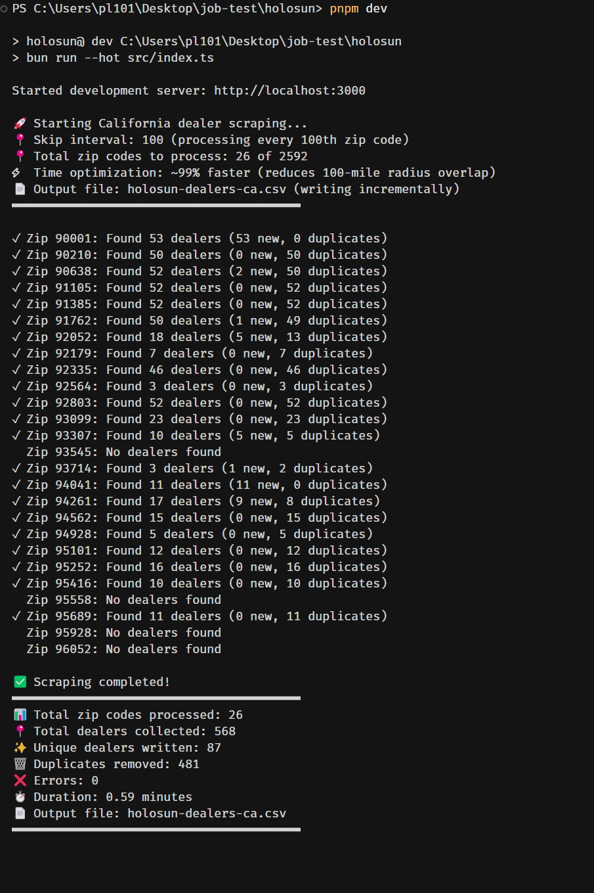
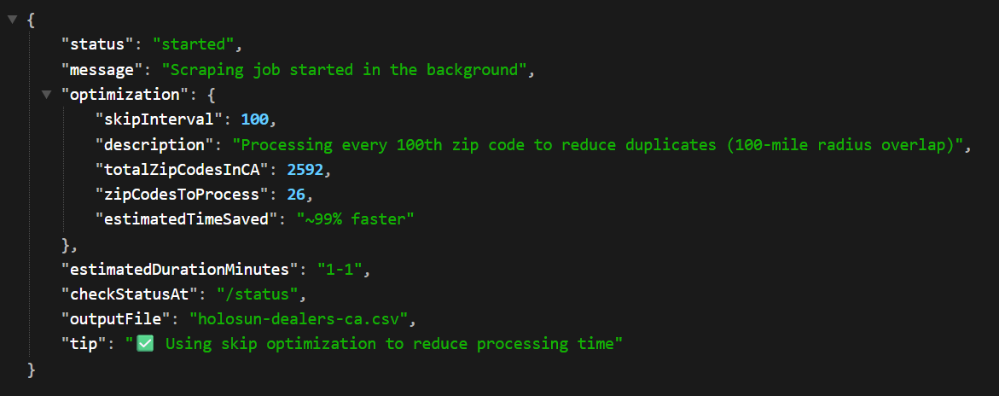

# Holosun Dealer Scraper API

A simple web scraper API to find Holosun dealers across California zip codes.

**Screenshot**

> console log


>API endpoint:


## Why Bun?

This project uses **Bun** as its JavaScript runtime and toolkit. Bun is an all-in-one JavaScript runtime that's significantly faster than Node.js, with built-in package management, bundling, and testing capabilities.

**Why I chose Bun:**

- **Speed**: Up to 4x faster than Node.js for most operations
- **Simplified tooling**: Package manager, bundler, and test runner built-in (no need for npm/yarn/webpack separately)
- **Native TypeScript support**: Run TypeScript files directly without compilation steps
- **Drop-in Node.js replacement**: Compatible with most Node.js packages and APIs
- **Better developer experience**: Faster installs, faster startup, faster everything

### Installing Bun

**macOS and Linux:**

```bash
curl -fsSL https://bun.sh/install | bash
```

**Windows:**

```powershell
powershell -c "irm bun.sh/install.ps1 | iex"
```

**Using npm (if you already have Node.js):**

```bash
npm install -g bun
```

**Verify installation:**

```bash
bun --version
```

For more installation options and troubleshooting, visit [bun.sh](https://bun.sh)

## Getting Started Locally

### Installation & Running

1. Install dependencies:

```bash
bun install
```

2. Start the development server:

```bash
bun run dev
```

The server will start on `http://localhost:3000`.

> type this url in your browser to get started, skip is optional as it saves time to run just for a demo purpose
```bash
http://localhost:3000/start?skip=100
```

## API Endpoints

### 1. **GET /** - API Information

Returns information about available endpoints.

```bash
curl http://localhost:3000/
```

---

### 2. **GET /start** - Start Full Scraping Job

Starts the California dealer scraping job in the background.

**Query Parameters:**

- `skip` (optional): Process every Nth zip code to reduce duplicates. Default: `1` (all zip codes)
  - Example: `skip=5` processes every 5th zip code
  - Recommended: Use `skip=5` or `skip=10` to save time since search radius overlaps

**Examples:**

```bash
# Process all zip codes (slower, more duplicates)
curl http://localhost:3000/start

# Process every 5th zip code (recommended)
curl http://localhost:3000/start?skip=5

# Process every 10th zip code (fastest)
curl http://localhost:3000/start?skip=10
```

**Response:**

```json
{
  "status": "started",
  "message": "Scraping job started in the background",
  "optimization": {
    "skipInterval": 5,
    "totalZipCodesInCA": 1700,
    "zipCodesToProcess": 340,
    "estimatedTimeSaved": "~80% faster"
  },
  "estimatedDurationMinutes": "2-3",
  "checkStatusAt": "/status",
  "outputFile": "holosun-dealers-ca.csv"
}
```

---

### 3. **GET /status** - Check Job Status

Check the progress of the currently running scraping job.

```bash
curl http://localhost:3000/status
```

**Response (while running):**

```json
{
  "status": "running",
  "progress": {
    "processedZipCodes": 150,
    "totalZipCodes": 340,
    "percentComplete": "44.1%",
    "currentZip": 90210,
    "dealersFound": 127,
    "errors": 0,
    "elapsedSeconds": 45
  }
}
```

---

### 4. **GET /test** - Test Mode

Run a quick test with the first 10 zip codes to verify the scraper is working.

```bash
curl http://localhost:3000/test
```

**Response:**

```json
{
  "status": "test_complete",
  "summary": {
    "testZipCodes": [90001, 90002, ...],
    "totalDealersFound": 85,
    "uniqueDealers": 67,
    "duplicatesRemoved": 18,
    "errorCount": 0,
    "durationSeconds": 15.32
  },
  "sampleDealers": [...]
}
```

---

### 5. **GET /debug/:zipcode** - Debug Single Zip Code

Test the scraper with a specific zip code to see detailed results.

```bash
# Example: Debug zip code 90002
curl http://localhost:3000/debug/90002
```

**Response:**

```json
{
  "zipCode": 90002,
  "dealersFound": 12,
  "dealers": [
    {
      "company_name": "Example Gun Shop",
      "contact_addr": "123 Main St, Los Angeles, CA 90002",
      "contact_phone": "(555) 123-4567",
      "contact_email": "info@example.com",
      "website": "https://example.com"
    }
  ]
}
```

---

## Output

The scraper writes results to **`holosun-dealers-ca.csv`** in the project root directory. The file is created and updated incrementally as the job runs, with automatic duplicate removal.

## Tips

- Use the `/test` endpoint first to verify everything works
- Use `skip=5` or `skip=10` for production runs to reduce duplicates and save time
- Check `/status` regularly to monitor progress
- The CSV file is written incrementally, so you can check partial results while the job is running
